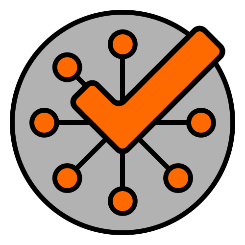

  
    
  
  
  
  
    
  <a href="https://gitdone.pages.dev/download/" download>
  <button style="
    background-color:#FF6A00;
    border:none;
    color:white;
    padding:15px 30px;
    text-align:center;
    text-decoration:none;
    display:inline-block;
    font-size:18px;
    cursor:pointer;">
    Download
  </button>
  </a>
    

# GitDone

**GitDone** is a Flutter-based mobile app designed to simplify your workflow by turning your to-dos
directly into GitHub issues. Stay organized and keep your development tasks in sync, right from your
phone.

For more information, visit the [GitDone Documentation](https://gitdone.pages.dev/).

## 🚀 Features

-   🔐 GitHub authentication (OAuth)
-   📝 Manage your to-dos as GitHub issues
-   🔄 GitHub integration for issue syncing
-   📦 Lightweight Flutter Android app

> ⚠️ Project is in early development.
> ⚠️ At the moment GitDone is provided for Android Devices only. We encourage anyone who has access to MAC/iOS devices and wants to contribute to the project to implement an iOS version! The only requirements are Xcode and an Apple Developer Account.

### 📅 Roadmap

See [open issues](https://github.com/RubberDuckCrew/gitdone/issues), [milestones](https://github.com/RubberDuckCrew/gitdone/milestones) and [pull requests](https://github.com/RubberDuckCrew/gitdone/pulls) for upcoming features and improvements.

## 🤝 Contributing

We appreciate contributions of all kinds! You can:

-   [Report a bug](https://github.com/RubberDuckCrew/gitdone/issues/new?template=bug_report.md)
-   [Request a feature](https://github.com/RubberDuckCrew/gitdone/issues/new?template=feature_request.md)
-   [Open a general issue](https://github.com/RubberDuckCrew/gitdone/issues/new/choose)
-   [Submit a pull request](https://github.com/RubberDuckCrew/gitdone/compare)
-   Help with [documentation](https://gitdone.pages.dev/)

To get started with development, see the [Development Guide](https://gitdone.pages.dev/development/).

-   Please follow our [Contributing Conventions](https://rubberduckcrew.pages.dev/contributing/conventions) to keep the codebase clean and consistent.
-   For setting up your local environment, check the [Local Setup Documentation](https://gitdone.pages.dev/development/setup).
-   For details on our CI/CD workflows, see the [CI/CD Guide](https://rubberduckcrew.pages.dev/development/ci-cd).

### 👥 Contributors

## 📄 License

This project is licensed under the [MIT License](LICENSE).
